# Loan Approval: Financial Risk Analysis

An analysis of 20,000 loan applications to find out which applicant details are linked to a loan being approved, and which ones make little difference.

A PDF version of the whole project is in [`Loan_Approval_Financial_Risk_Analysis.pdf`](Loan_Approval_Financial_Risk_Analysis.pdf), and a two page plain language summary for lenders is in [`Lender_Brief.pdf`](Lender_Brief.pdf).

## Results at a glance

| Applications | Approved | Approval rate | Strongest factor | Model accuracy |
|:---:|:---:|:---:|:---:|:---:|
| 20,000 | 4,780 | 23.9% | Annual income | 88% |

Only about one application in four is approved. Income decides most of it: the highest earning quarter of applicants is approved about 65% of the time, the lowest earning quarter about 1% of the time. The size of the loan compared with income and the share of income already going to debt matter almost as much. Savings balance and job tenure make almost no difference.

The model was also checked with cross validation, a random forest comparison, significance tests and a fairness check across age and other groups. The results are further down, together with what a lender should take from them.

## Dataset

The data comes from the [Financial Risk for Loan Approval](https://www.kaggle.com/datasets/lorenzozoppelletto/financial-risk-for-loan-approval) dataset on Kaggle. `Loan.csv` has 20,000 applications and 36 columns, with no missing values and no duplicate rows.

I used these columns: `ApplicationDate`, `AnnualIncome`, `CreditScore`, `EmploymentStatus`, `LoanAmount`, `SavingsAccountBalance`, `TotalAssets`, `TotalLiabilities`, `JobTenure`, `HomeOwnershipStatus` and `LoanApproved`. Later I added `TotalDebtToIncomeRatio`, `InterestRate` and `RiskScore` to look at them more closely.

The dataset is synthetic. The application dates run one per day from January 2018 to October 2072, so there is no real trend over time. I only used the dates to confirm that, and not in the rest of the analysis.

## What I did

1. Loaded and checked the data (data types, missing values, duplicates)
2. Split each variable into groups of equal size and compared the **approval rate** of each group, which is approved loans divided by applicants. Comparing rates instead of raw counts keeps bigger groups from looking better just because they are bigger.
3. Created a new column, loan amount divided by annual income, and looked at income and loan size together
4. Checked debt to income ratio, interest rate and RiskScore, and explained why the last two should not be used to explain approval
5. Trained a logistic regression on an 80% training split and tested it on the other 20%
6. Tested the model again with 5 fold cross validation, compared it with a random forest and with simpler versions of itself
7. Checked whether the small differences between groups are real, using chi-square tests and confidence intervals
8. Checked whether the model treats groups of applicants differently, for example by age
9. Wrote down what a lender should take from the results

## Findings

### Income matters most

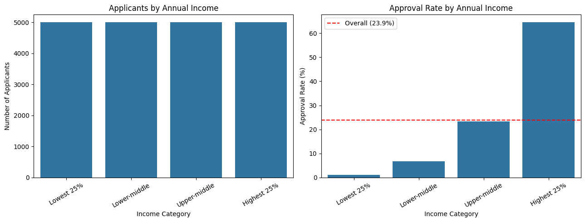

The four income groups each hold 5,000 applicants, so the right hand chart is a fair comparison. The red dashed line marks the overall approval rate of 23.9%. Only the highest earning quarter is far above it. That group also makes up 67% of all approved loans (3,223 of 4,780).

### Loan size has to be read next to income

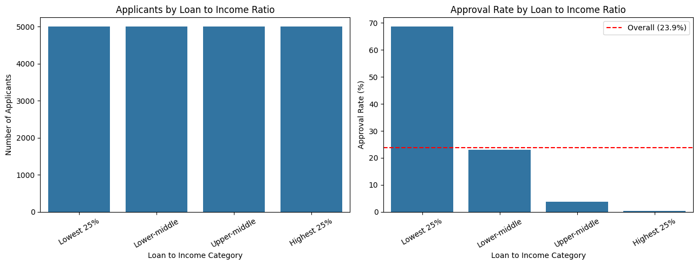

A loan of 30,000 is easy for a high earner and hard for a low earner. When the loan is up to about a quarter of yearly income, around 69% of applications are approved. When the loan is above about three quarters of yearly income, only 0.3% are.

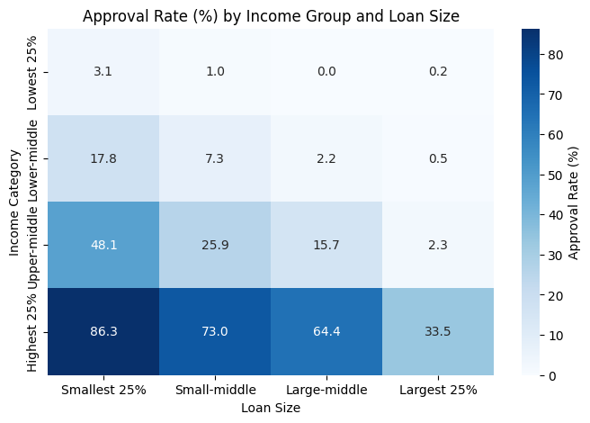

The heatmap shows the same thing from the other side. Low earners are almost never approved, even for the smallest loans. High earners are approved 86% of the time for small loans but only 34% of the time for the largest ones.

### The other variables

| Variable | Group with the lowest approval rate | Group with the highest approval rate | Effect on approval |
| :--- | :--- | :--- | :--- |
| Annual Income (USD) | Lowest 25% (1.0%) | Highest 25% (64.5%) | Very strong |
| Loan to Income Ratio | Highest 25% (0.3%) | Lowest 25% (68.6%) | Very strong |
| Total Debt to Income Ratio | Highest 25% (0.5%) | Lowest 25% (67.5%) | Very strong |
| Loan Amount (USD) | Largest 25% (9.1%) | Smallest 25% (39.3%) | Strong |
| Interest Rate | Highest 25% (8.5%) | Lowest 25% (42.6%) | Strong |
| Credit Score | Below 450 (13.9%) | 650 and above (44.5%) | Moderate |
| Assets to Liabilities Ratio | Below 1 (owes more than owns) (18.3%) | Above 5 (30.3%) | Moderate |
| Employment Status | Unemployed (18.2%) | Self-Employed (27.8%) | Small |
| Home Ownership Status | Other (20.5%) | Mortgage (25.2%) | Small |
| Job Tenure (years) | 0 to 1 yrs (22.4%) | 10+ yrs (25.1%) | None |
| Savings Account Balance (USD) | Lowest 25% (22.8%) | Lower middle (24.3%) | None |

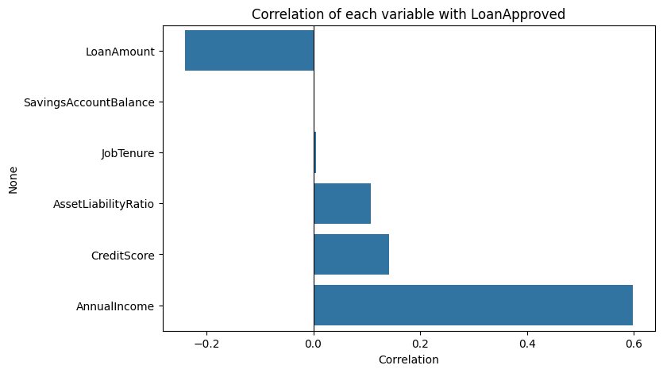

Credit score helps steadily: scores below 450 are approved about 14% of the time and scores of 650 and above about 45% of the time. Most applicants sit in the middle, so those two groups are small.

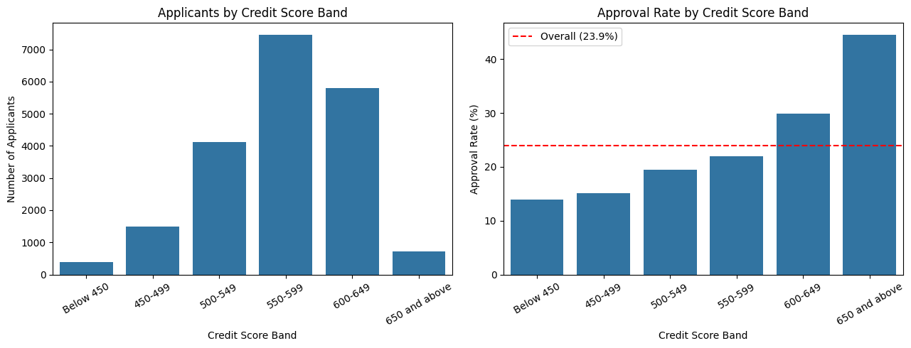

Bigger loans are approved less often, from 39% for the smallest quarter to 9% for the largest quarter.

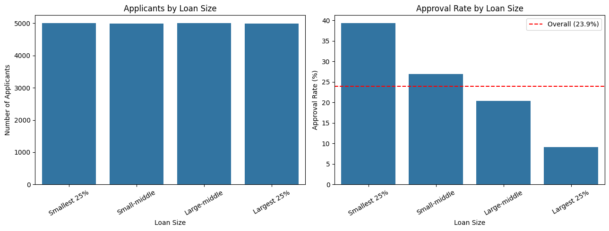

Debt to income ratio shows the strongest pattern after income. Applicants with a ratio up to about 0.18 are approved 67.5% of the time and those above about 0.51 only 0.5% of the time.

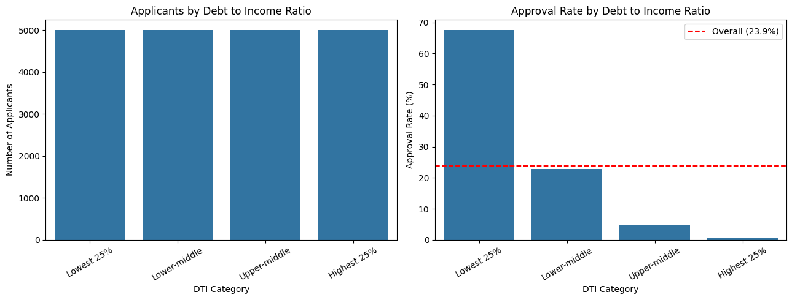

### RiskScore and InterestRate are set by the lender

RiskScore has the strongest link to approval of any column (correlation about negative 0.77), and approved applicants have a clearly lower score than rejected ones. But the lender most likely calculates it from the same information used to make the decision, so using it to explain approval would be circular. Interest rate has a similar problem, because riskier applicants are offered higher rates. I studied both and kept both out of the model.

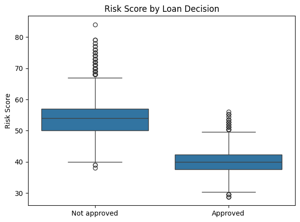

### Predicting approval

A logistic regression using applicant information only (income, credit score, loan amount, savings, job tenure, assets to liabilities ratio, loan to income ratio, debt to income ratio, employment status and home ownership) was tested on 4,000 applications it had never seen.

| Metric | Without RiskScore (used) | With RiskScore (comparison only) |
| :--- | :---: | :---: |
| Accuracy | 88.3% | 98.3% |
| Precision | 79.9% | 97.1% |
| Recall | 68.4% | 95.7% |
| F1 score | 73.7% | 96.4% |
| ROC AUC | 0.941 | 0.998 |

The model is right 88.3% of the time. A model that rejects every application would be right 76.1% of the time, so it adds real value. Accuracy on the training data was 88.0%, almost the same, so the model is not overfitting. Adding RiskScore pushes accuracy to 98.3%, but that is the circular effect described above, so I kept it out of the real model.

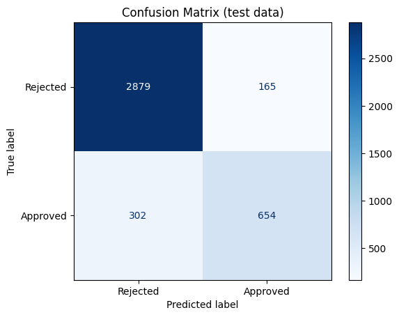

The loan to income ratio is the strongest push towards rejection, followed by debt to income ratio and loan amount. Annual income, the assets to liabilities ratio and credit score push towards approval. Savings and job tenure are close to zero.

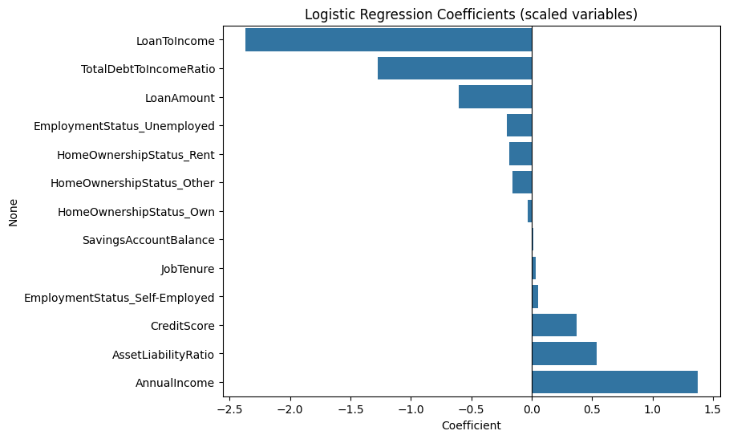

At the default cutoff of 0.5 the model is the most precise but misses about three in ten approved loans. Lowering the cutoff finds more of them at the cost of precision.

| Cutoff | Accuracy | Precision | Recall |
| :---: | :---: | :---: | :---: |
| 0.3 | 87.1% | 68.7% | 84.1% |
| 0.4 | 88.2% | 74.6% | 76.9% |
| 0.5 | 88.3% | 79.9% | 68.4% |

### Checking the model further

**Cross validation and a second model.** In 5 fold cross validation the data is split into 5 parts, and every application is used for testing exactly once. The number after +/- is the spread between the folds. A random forest was compared with the logistic regression.

| Metric | Logistic regression | Random forest |
| :--- | :---: | :---: |
| Accuracy | 0.880 +/- 0.002 | 0.879 +/- 0.002 |
| Precision | 0.786 +/- 0.013 | 0.774 +/- 0.005 |
| Recall | 0.687 +/- 0.013 | 0.697 +/- 0.009 |
| F1 score | 0.733 +/- 0.005 | 0.733 +/- 0.005 |
| ROC AUC | 0.939 +/- 0.003 | 0.937 +/- 0.002 |

The random forest is no better than the logistic regression, and the gaps are smaller than the spread between folds. The simpler model is kept because it is easier to explain. The cross validated accuracy of 88.0% is slightly below the 88.3% from the single split above, so 88.0% is the more honest figure to quote. The tree based model that I first suggested trying did not help on this data.

**How simple can the model be?**

| Version of the model | Accuracy | Recall | ROC AUC |
| :--- | :---: | :---: | :---: |
| All 10 variables (current model) | 0.880 | 0.687 | 0.939 |
| Without employment and home ownership | 0.880 | 0.688 | 0.938 |
| Without savings and job tenure | 0.881 | 0.689 | 0.939 |
| Loan to income and debt to income only | 0.863 | 0.692 | 0.921 |
| Those two plus income and credit score | 0.876 | 0.689 | 0.930 |

Removing employment status and home ownership costs nothing, and neither does removing savings balance and job tenure. Using only the loan to income ratio and the debt to income ratio still gets 86.3% of decisions right.

**Are the small differences real?** A chi-square test gives a p-value, and below 0.05 means the difference is unlikely to be chance. With 20,000 applications even tiny differences pass, so the table also shows Cramer's V, which measures how big the link is (below 0.1 is very weak, above 0.3 is strong).

| Variable | p-value | Cramer's V | Real difference? |
| :--- | :---: | :---: | :---: |
| Loan to income ratio | below 0.001 | 0.638 | Yes |
| Debt to income ratio | below 0.001 | 0.622 | Yes |
| Annual income | below 0.001 | 0.581 | Yes |
| Loan amount | below 0.001 | 0.256 | Yes |
| Credit score | below 0.001 | 0.146 | Yes |
| Assets to liabilities ratio | below 0.001 | 0.115 | Yes |
| Employment status | below 0.001 | 0.044 | Yes |
| Home ownership | below 0.001 | 0.036 | Yes |
| Savings balance | 0.216 | 0.015 | No |
| Job tenure | 0.529 | 0.013 | No |

Savings balance and job tenure cannot be told apart from chance. Employment status and home ownership are real but tiny. The confidence intervals agree: for employed (24.0%), self-employed (27.8%) and unemployed (18.2%) applicants the 95% ranges do not overlap, while every job tenure group and every savings group overlaps with every other.

**Fairness check.** The model does not use age, marital status or education, but other variables can stand in for them. On the 4,000 test applications the model still approves younger applicants less often, even though it never sees age.

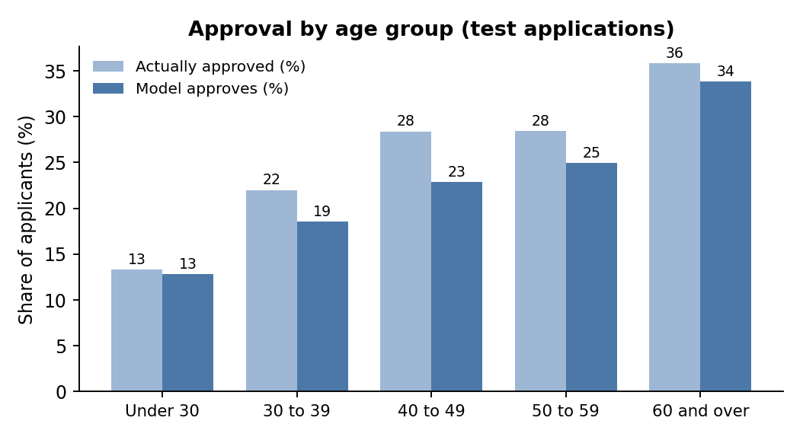

| Group | Applicants | Actually approved | Model approves | Approved loans found |
| :--- | ---: | ---: | ---: | ---: |
| Under 30 | 773 | 13.3% | 12.8% | 60.2% |
| 30 to 39 | 1,227 | 22.0% | 18.6% | 64.1% |
| 40 to 49 | 1,197 | 28.4% | 22.9% | 69.4% |
| 50 to 59 | 605 | 28.4% | 25.0% | 73.8% |
| 60 and over | 198 | 35.9% | 33.8% | 78.9% |

Younger applicants have lower incomes and credit scores and ask for larger loans compared with income, which explains part of the gap but not all of it. Among the highest earners, 49% of applicants under 30 are approved against 69% of those aged 40 to 49. The model also finds fewer of the approved loans for single (62%), unemployed (56%) and renting (63%) applicants. The tables for marital status, education, employment and home ownership are below.

Fairness tables for the other groups

**Marital status**

| Group | Applicants | Actually approved | Model approves | Approved loans found |
| :--- | ---: | ---: | ---: | ---: |
| Divorced | 540 | 23.0% | 21.7% | 72.6% |
| Married | 2,037 | 24.0% | 21.3% | 71.8% |
| Single | 1,251 | 24.1% | 18.7% | 61.6% |
| Widowed | 172 | 23.8% | 20.3% | 65.9% |

**Education level**

| Group | Applicants | Actually approved | Model approves | Approved loans found |
| :--- | ---: | ---: | ---: | ---: |
| Associate | 820 | 19.8% | 18.5% | 69.1% |
| Bachelor | 1,217 | 26.7% | 22.2% | 68.9% |
| Doctorate | 159 | 43.4% | 30.8% | 66.7% |
| High School | 1,154 | 14.4% | 14.6% | 71.7% |
| Master | 650 | 36.0% | 27.5% | 65.4% |

**Employment status**

| Group | Applicants | Actually approved | Model approves | Approved loans found |
| :--- | ---: | ---: | ---: | ---: |
| Employed | 3,402 | 24.2% | 20.7% | 68.8% |
| Self-Employed | 311 | 26.4% | 24.8% | 72.0% |
| Unemployed | 287 | 17.4% | 13.2% | 56.0% |

**Home ownership**

| Group | Applicants | Actually approved | Model approves | Approved loans found |
| :--- | ---: | ---: | ---: | ---: |
| Mortgage | 1,624 | 24.9% | 22.7% | 70.1% |
| Other | 415 | 17.3% | 14.9% | 66.7% |
| Own | 786 | 26.5% | 22.6% | 72.6% |
| Rent | 1,175 | 23.1% | 18.0% | 63.1% |

Full approval rate tables for every variable

**Annual Income (USD)**

| Group | Range of values | Applicants | Approved | Approval rate |
| :--- | :--- | ---: | ---: | ---: |
| Lowest 25% | 15,000 to 31,676 | 5,000 | 52 | 1.0% |
| Lower middle | 31,680 to 48,565 | 5,000 | 342 | 6.8% |
| Upper middle | 48,567 to 74,388 | 5,000 | 1,163 | 23.3% |
| Highest 25% | 74,400 to 485,341 | 5,000 | 3,223 | 64.5% |

**Loan to Income Ratio**

| Group | Range of values | Applicants | Approved | Approval rate |
| :--- | :--- | ---: | ---: | ---: |
| Lowest 25% | 0.03 to 0.26 | 5,000 | 3,431 | 68.6% |
| Lower middle | 0.26 to 0.45 | 5,000 | 1,149 | 23.0% |
| Upper middle | 0.45 to 0.78 | 5,000 | 184 | 3.7% |
| Highest 25% | 0.78 to 7.54 | 5,000 | 16 | 0.3% |

**Total Debt to Income Ratio**

| Group | Range of values | Applicants | Approved | Approval rate |
| :--- | :--- | ---: | ---: | ---: |
| Lowest 25% | 0.02 to 0.18 | 5,000 | 3,374 | 67.5% |
| Lower middle | 0.18 to 0.30 | 5,000 | 1,146 | 22.9% |
| Upper middle | 0.30 to 0.51 | 5,000 | 236 | 4.7% |
| Highest 25% | 0.51 to 4.65 | 5,000 | 24 | 0.5% |

**Loan Amount (USD)**

| Group | Range of values | Applicants | Approved | Approval rate |
| :--- | :--- | ---: | ---: | ---: |
| Smallest 25% | 3,674 to 15,575 | 5,001 | 1,964 | 39.3% |
| Small middle | 15,578 to 21,914 | 4,999 | 1,345 | 26.9% |
| Large middle | 21,915 to 30,835 | 5,001 | 1,018 | 20.4% |
| Largest 25% | 30,836 to 184,732 | 4,999 | 453 | 9.1% |

**Interest Rate**

| Group | Range of values | Applicants | Approved | Approval rate |
| :--- | :--- | ---: | ---: | ---: |
| Lowest 25% | 0.113 to 0.209 | 5,000 | 2,129 | 42.6% |
| Lower middle | 0.209 to 0.235 | 5,000 | 1,368 | 27.4% |
| Upper middle | 0.235 to 0.266 | 5,000 | 860 | 17.2% |
| Highest 25% | 0.266 to 0.447 | 5,000 | 423 | 8.5% |

**Credit Score**

| Group | Range of values | Applicants | Approved | Approval rate |
| :--- | :--- | ---: | ---: | ---: |
| Below 450 | 343 to 449 | 396 | 55 | 13.9% |
| 450 to 499 | 450 to 499 | 1,495 | 226 | 15.1% |
| 500 to 549 | 500 to 549 | 4,129 | 801 | 19.4% |
| 550 to 599 | 550 to 599 | 7,450 | 1,641 | 22.0% |
| 600 to 649 | 600 to 649 | 5,809 | 1,736 | 29.9% |
| 650 and above | 650 to 712 | 721 | 321 | 44.5% |

**Assets to Liabilities Ratio**

| Group | Range of values | Applicants | Approved | Approval rate |
| :--- | :--- | ---: | ---: | ---: |
| Below 1 (owes more than owns) | 0.01 to 1.00 | 4,629 | 849 | 18.3% |
| 1 to 2 | 1.00 to 2.00 | 3,546 | 700 | 19.7% |
| 2 to 5 | 2.00 to 5.00 | 5,129 | 1,204 | 23.5% |
| Above 5 | 5.00 to 559.49 | 6,696 | 2,027 | 30.3% |

**Employment Status**

| Group | Range of values | Applicants | Approved | Approval rate |
| :--- | :--- | ---: | ---: | ---: |
| Employed |  | 17,036 | 4,089 | 24.0% |
| Self-Employed |  | 1,573 | 438 | 27.8% |
| Unemployed |  | 1,391 | 253 | 18.2% |

**Home Ownership Status**

| Group | Range of values | Applicants | Approved | Approval rate |
| :--- | :--- | ---: | ---: | ---: |
| Mortgage |  | 7,939 | 1,997 | 25.2% |
| Other |  | 2,036 | 417 | 20.5% |
| Own |  | 3,938 | 980 | 24.9% |
| Rent |  | 6,087 | 1,386 | 22.8% |

**Job Tenure (years)**

| Group | Range of values | Applicants | Approved | Approval rate |
| :--- | :--- | ---: | ---: | ---: |
| 0 to 1 yrs | 0 to 1 | 804 | 180 | 22.4% |
| 2 to 3 yrs | 2 to 3 | 4,434 | 1,041 | 23.5% |
| 4 to 5 yrs | 4 to 5 | 7,137 | 1,748 | 24.5% |
| 6 to 10 yrs | 6 to 10 | 7,374 | 1,748 | 23.7% |
| 10+ yrs | 11 to 16 | 251 | 63 | 25.1% |

**Savings Account Balance (USD)**

| Group | Range of values | Applicants | Approved | Approval rate |
| :--- | :--- | ---: | ---: | ---: |
| Lowest 25% | 73 to 1,541 | 5,000 | 1,140 | 22.8% |
| Lower middle | 1,542 to 2,986 | 5,001 | 1,216 | 24.3% |
| Upper middle | 2,987 to 5,873 | 4,999 | 1,214 | 24.3% |
| Highest 25% | 5,874 to 200,089 | 5,000 | 1,210 | 24.2% |

## What a lender should take from these results

A two page plain language version of this section is in [`Lender_Brief.pdf`](Lender_Brief.pdf).

1. **Affordability decides most outcomes.** The loan to income ratio and the debt to income ratio on their own predict 86% of decisions correctly, and the full model reaches 88%. Both can be explained to an applicant in plain words.
2. **Do not penalise what does not matter.** Savings balance and job tenure make no real difference to approval, and removing them from the model costs nothing.
3. **Use the model to support people, not to replace them.** At the standard cutoff it misses about 3 in 10 of the loans that were approved. Borderline cases (a probability of approval between about 0.3 and 0.5) are good candidates for manual review.
4. **Treat fairness as an ongoing check.** The model does not use age, marital status or education, but it still approves younger applicants and renters less often. Repeat the group checks on every new version of the model.
5. **Remove variables that add almost nothing.** Employment status and home ownership have a very weak link to approval and the model is just as accurate without them. Rules on which characteristics may be used in credit decisions differ from country to country, so this needs legal review before any real use.
6. **Do not use RiskScore or InterestRate to explain approval.** Both come from the lender's own process.

**Limits.** The dataset is synthetic, so the sharp patterns describe how the data was generated and not how real lenders behave. The work should be repeated on real application data before anyone relies on it. The statistical links show association, not cause.

## How to run it

The easiest way is Google Colab:

1. Open the notebook in Colab: [Open in Colab](https://colab.research.google.com/github/nachiket-1/Loan-Approval-Financial-Risk-Analysis/blob/main/Loan_Approval_Financial_Risk_Analysis.ipynb)
2. Choose Runtime, then Run all. The notebook reads `Loan.csv` straight from this repo, so nothing needs to be uploaded.

To run it on your own computer:

1. Download the repo and keep `Loan.csv` in the same folder as the notebook
2. Install the packages with `pip install pandas numpy seaborn matplotlib scikit-learn jupyter`
3. Start Jupyter with `jupyter notebook` and open `Loan_Approval_Financial_Risk_Analysis.ipynb`

## Files in this repo

| File | What it is |
|:---|:---|
| `Loan_Approval_Financial_Risk_Analysis.ipynb` | The full analysis with charts and findings |
| `Loan.csv` | The dataset |
| `Loan_Approval_Financial_Risk_Analysis.pdf` | The whole project as a PDF, easy to read on a phone |
| `Lender_Brief.pdf` | A two page plain language summary for lenders |
| `images/` | The charts used in this README |
| `README.md` | This file |

